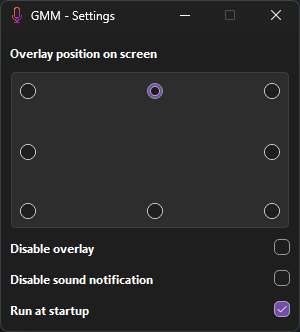

# GlobalMicMute

Global microphone mute shortcut for windows

  

## Download

Grab latest release [here](https://github.com/Odizinne/GlobalMicMute/releases/latest)

## Features

- Mute windows default microphone with shortcut (`CTRL` + `ALT` + `M`) or tray icon click
- Sound notification when toggling mute
- Overlay when muted
- Tray icon status
